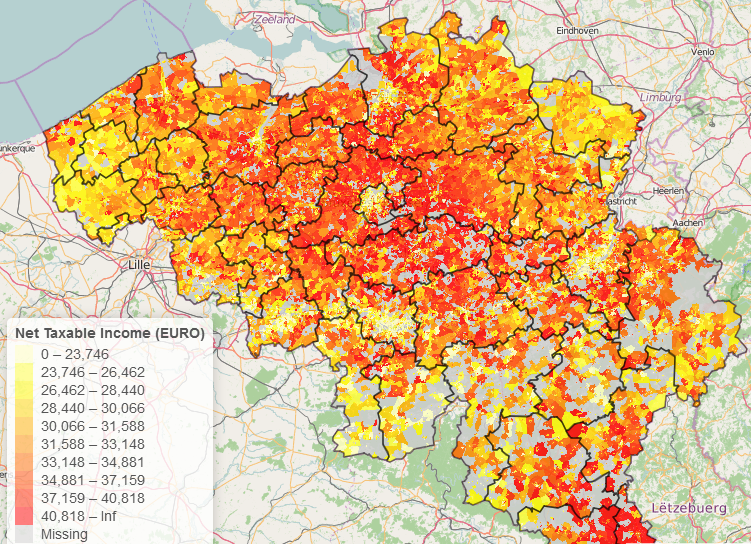

# Administrative boundaries of Belgium based on Open Data available at Statistics Belgium

The  **BelgiumMaps.StatBel** package contains maps with administrative boundaries (national, regions, provinces, districts, municipalities, statistical sectors, agglomerations (200m)) of Belgium extracted from Open Data at Statistics Belgium (http://statbel.fgov.be/en/statistics/opendata). Data is converted from Lambert CRS into the WGS84 coordinate reference system. 

This data is available in several objects:

- BE_ADMIN_SECTORS: SpatialPolygonsDataFrame with polygons and data at the level of the statistical sector
- BE_ADMIN_MUNTY: SpatialPolygonsDataFrame with polygons and data at the level of the municipality
- BE_ADMIN_DISTRICT: SpatialPolygonsDataFrame with polygons and data at the level of the district
- BE_ADMIN_PROVINCE: SpatialPolygonsDataFrame with polygons and data at the level of the province
- BE_ADMIN_REGION: SpatialPolygonsDataFrame with polygons and data at the level of the region
- BE_ADMIN_BELGIUM: SpatialPolygonsDataFrame with polygons and data at the level of the whole of Belgium
- BE_ADMIN_HIERARCHY: data.frame with administrative hierarchy of Belgium
- BE_ADMIN_AGGLOMERATIONS: SpatialPolygonsDataFrame with polygons and data at the level of an agglomeration (200m)




## Installation

The package is available at datatailor.be

```
install.packages("sp")
install.packages("BelgiumMaps.StatBel", repos = "http://www.datatailor.be/rcube", type = "source")
vignette("BelgiumMaps_AdministrativeAreas_StatBel", package = "BelgiumMaps.StatBel")
```

The package is developed at https://gitlab.datatailor.be/open-source/BelgiumMaps.StatBel
To install the latest version from the repository itself:

```
install.packages(c('sp', 'knitr', 'markdown'))
devtools::install_git("https://gitlab.datatailor.be/open-source/BelgiumMaps.StatBel", build_vignettes = TRUE)
## See the vignette
vignette("BelgiumMaps_AdministrativeAreas_StatBel", package = "BelgiumMaps.StatBel")
```

## License

The package is available under the CC BY 2.0 license. More info: https://creativecommons.org/licenses/by/2.0. This license is compatible with the LICENCE file given by Statistics Belgium. More info at inst/extdata/LICENCE and inst/COPYRIGHTS.


## Support in geospatial analysis

Need support in geospatial analysis or geospatial mapping. 
Contact BNOSAC: http://www.bnosac.be

